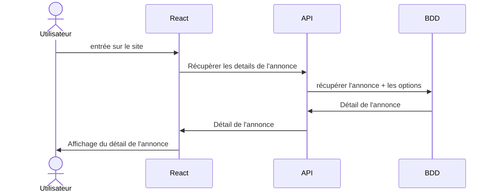

# sequences detail

## sequences detail d'une annonce

```mermaid
sequenceDiagram
    actor Utilisateur
    participant React
    participant API
    participant BDD
    Utilisateur ->> React: entrée sur le site
    React ->> API: Récupèrer les details de l'annonce
    API ->> BDD: récupérer l'annonce + les options
    BDD ->> API: Détail de l'annonce
    API ->> React: Détail de l'annonce
    React ->> Utilisateur: Affichage du détail de l'annonce 
```
